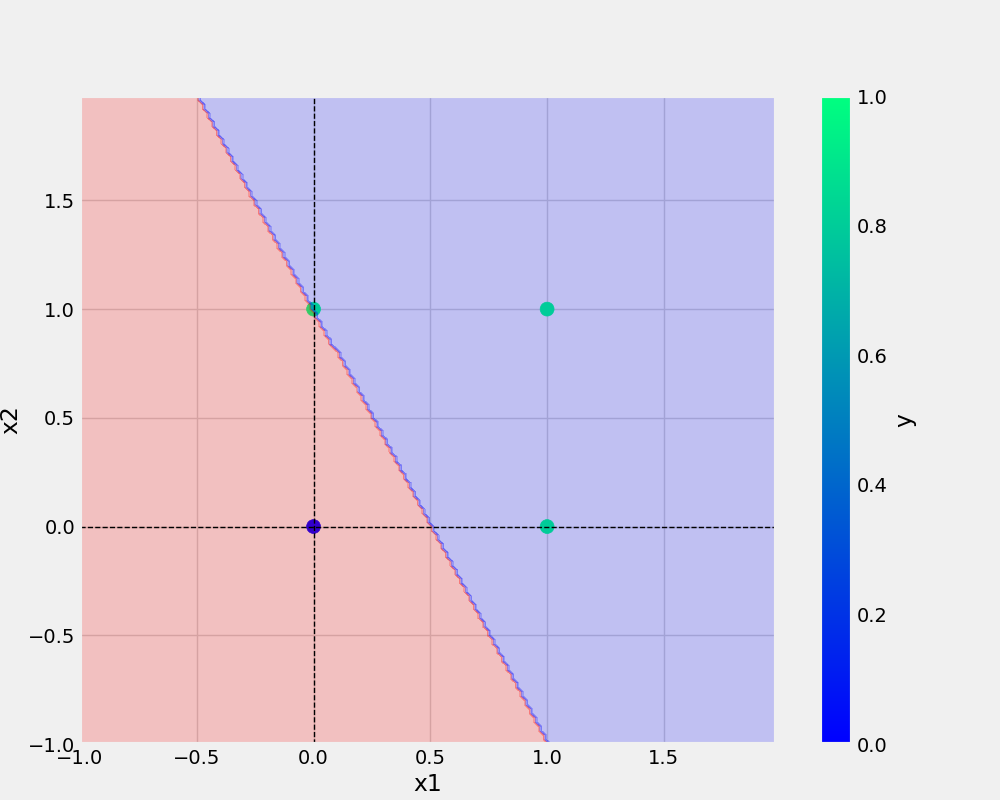

# oneNeuron
oneNeuron | perceptron


# commands used -


```bash
git add . && git commit -m "docstring updated" && git push origin main
```

# Add URL
[Git Handbook](https://guides.github.com/introduction/git-handbook/)

<a href= "https://github.com/SourabhSomdeve/OneNeuron">My github page</a>

# Add Image



# Add Python code

```python
def main(data, modelName, plotName, eta, epochs):
    df = pd.DataFrame(data)
    print(df)
    X, y = prepare_data(df)
    model = Perceptron(eta=eta, epochs=epochs)
    model.fit(X, y)
    _ = model.total_loss()
    save_model(model, filename=modelName)
    save_plot(df, plotName, model)
```

# datasets (table)

x1 | x2 | y
-|-|-
0|0|0
0|1|0
1|0|0
1|1|1

# Number points
1. First point
2. Second point


# bullets points 
* First point
* Second point